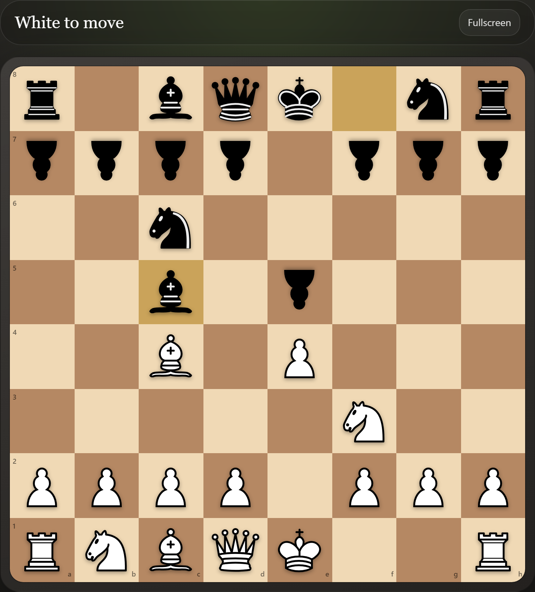
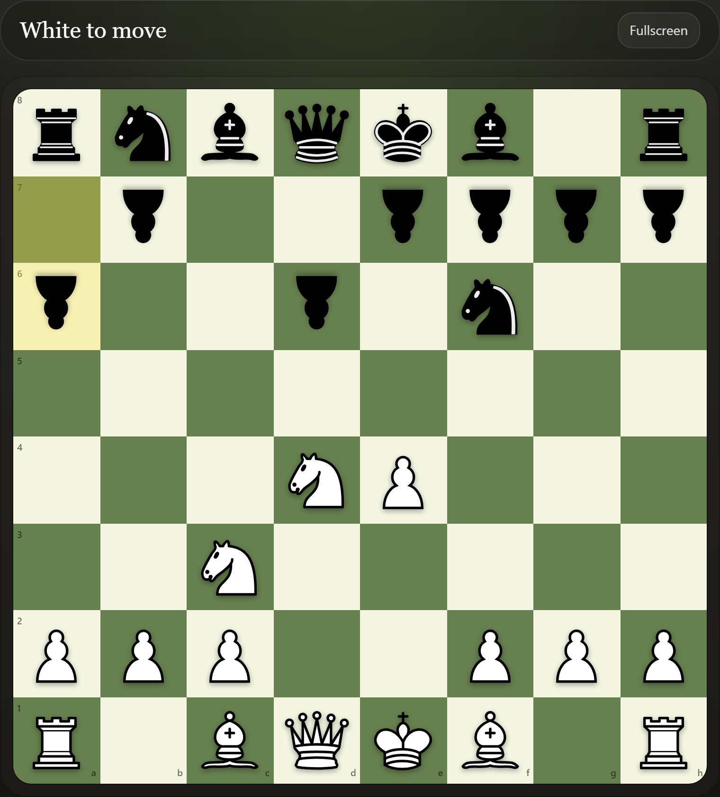
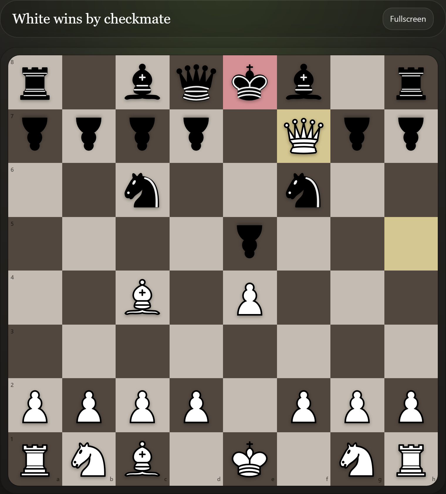

<div align="center">


# Chaturanga

**Play chess in VS Code — against a friend or an offline computer opponent.**

[](https://marketplace.visualstudio.com/items?itemName=ToqirAhmad.chaturanga)
[](https://marketplace.visualstudio.com/items?itemName=ToqirAhmad.chaturanga)
[](https://marketplace.visualstudio.com/items?itemName=ToqirAhmad.chaturanga)
[](https://marketplace.visualstudio.com/items?itemName=ToqirAhmad.chaturanga&ssr=false#review-details)
[](https://opensource.org/licenses/MIT)

A full chess board right inside your editor — real Staunton pieces, multiple themes, and a fast offline opponent. No account, no network, no distractions.

</div>

---

## Why Chaturanga

- ♟️ **Two ways to play** — face a friend on the same board, or an offline computer opponent.
- ⚡ **Fast, offline engine** — the computer responds instantly. Nothing leaves your machine.
- 🎨 **Real pieces, real themes** — classic Staunton pieces with five board themes.
- 🕹️ **Full game controls** — move history, undo / redo, board flip, and a fullscreen view.
- 💾 **Save & resume** — keep games between sessions; import / export PGN and FEN.
- 🧩 **Native feel** — lives in the Activity Bar with a sidebar for controls and game info.
- 🔓 **Open source** — MIT licensed.

---

## Game Modes

| Mode | Description |
| --- | --- |
| 👥 **Play a Friend** | Two players share the same board — perfect for a quick game with a colleague. |
| 🤖 **Play the Computer** | Take on an offline opponent at your chosen difficulty. |

### Difficulty

| Level | Style |
| --- | --- |
| 🟢 **Easy** | Quick, casual replies — great for warming up. |
| 🟡 **Medium** | Looks a little deeper and punishes loose moves. |
| 🔴 **Hard** | Searches further for a tougher game. |

---

## Board Themes & Pieces

| 🎨 Themes | ♟️ Piece Sets |
| --- | --- |
| Classic | Classic |
| Green | Neo |
| Blue | Alpha |
| Dark | Wood |
| Purple | |

Set your defaults in **Settings** (see [Settings](#settings)) or switch on the fly from the in-board settings panel.

---

## Screenshots

### ♟️ Classic Board

Real Staunton pieces on the classic theme, with move highlights and coordinates.



### 🤖 Play the Computer

Take on the offline opponent — here mid-game on the green theme.



### 🌙 Dark Theme

Checkmate on the dark board, with check and last-move highlights.



---

## Installation

### Easy Installation

1. Open **Visual Studio Code**.
2. Go to the **Extensions** view (`Ctrl+Shift+X` / `Cmd+Shift+X`).
3. Search for **Chaturanga**.
4. Click **Install**.
5. Open the **Chess** icon in the Activity Bar.
6. Click **New Game** and start playing.

### Alternate Installation (Command Palette)

1. Open the **Quick Open** bar (`Ctrl+P` / `Cmd+P`).
2. Paste the command below and press **Enter**:

```
ext install ToqirAhmad.chaturanga
```

---

## How to Play

1. Open the **Chess** view from the **Activity Bar**.
2. Click **New Game** to open the board.
3. Use the sidebar to choose a mode (**Friend** or **Computer**), set difficulty, and control the game.
4. Click a piece to see its legal moves, then click a destination square to play.
5. Use the sidebar (or the shortcuts below) to undo, redo, flip the board, and save your game.

---

## Commands

Open the **Command Palette** (`Ctrl+Shift+P` / `Cmd+Shift+P`) and search for **Chess**:

| Command | Description |
| --- | --- |
| **Chess: Open Board** | Open the chess board panel. |
| **Chess: New Game** | Start a fresh game. |
| **Chess: Flip Board** | Flip the board orientation. |
| **Chess: Undo Move** | Take back the last move. |
| **Chess: Redo Move** | Replay an undone move. |
| **Chess: Resume Game** | Resume a saved game. |
| **Chess: Import PGN** | Load a game from PGN. |
| **Chess: Export PGN** | Export the current game as PGN. |
| **Chess: Copy FEN** | Copy the current position as FEN. |
| **Chess: Paste FEN** | Load a position from FEN. |
| **Chess: Open Settings** | Open the in-board settings panel. |

---

## Keyboard Shortcuts

Active while the chess board panel is focused:

| Action | Windows / Linux | macOS |
| --- | --- | --- |
| New Game | `Ctrl+Alt+N` | `Cmd+Alt+N` |
| Undo | `Ctrl+Z` | `Cmd+Z` |
| Redo | `Ctrl+Y` | `Cmd+Shift+Z` |
| Flip Board | `Ctrl+Alt+F` | `Cmd+Alt+F` |
| Resume Game | `Ctrl+Alt+R` | `Cmd+Alt+R` |

---

## Settings

| Setting | Default | Options |
| --- | --- | --- |
| `chess.defaultTheme` | `classic` | `classic`, `green`, `blue`, `dark`, `purple` |
| `chess.defaultPieceSet` | `classic` | `classic`, `neo`, `alpha`, `wood` |

---

## FAQ

**Does it work offline?**
Yes — Chaturanga is fully offline. There is no account, no sign-in, and nothing leaves your machine.

**How strong is the computer?**
It's tuned for a fast, casual game rather than tournament strength. Pick **Hard** for a tougher opponent.

**Can I save and resume games?**
Yes. Games are saved locally and can be resumed later. You can also import / export **PGN** and copy / paste **FEN**.

**Is there online / multiplayer play?**
No. Chaturanga is designed for local play — against a friend on the same board or against the computer.

**How do I request a feature or report a bug?**
Open an issue on the [GitHub repository](https://github.com/TOQIR-AHMAD/Chaturanga).

---

## Contributing & Development

Chaturanga is a VS Code extension with a React (Vite) webview UI.

```bash
# install dependencies (root + webview)
npm install
npm --prefix webview-ui install

# build everything (webview + extension)
npm run build

# develop with live rebuilds
npm run dev

# package a .vsix
npm run package
```

Pull requests and issues are welcome on the [GitHub repository](https://github.com/TOQIR-AHMAD/Chaturanga).

---

## Credits

Chess pieces by **Colin M.L. Burnett** (the "cburnett" set), used under the BSD license.

---

## License

[MIT](https://opensource.org/licenses/MIT) © Toqir Ahmad

<div align="center">

⭐ If you enjoy Chaturanga, please consider [leaving a review](https://marketplace.visualstudio.com/items?itemName=ToqirAhmad.chaturanga&ssr=false#review-details)!

</div>
